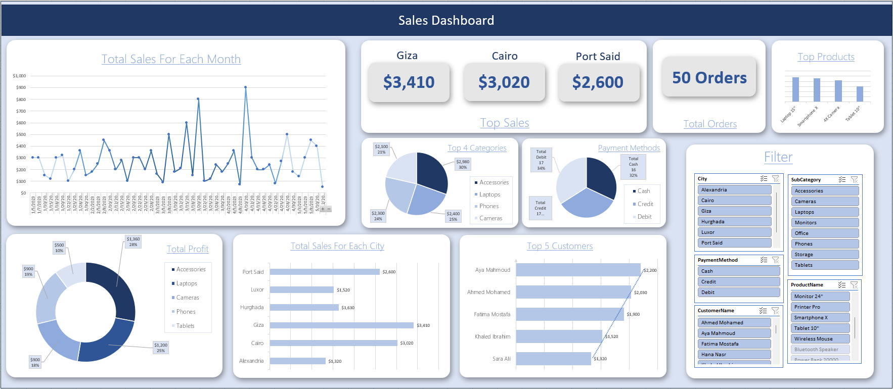

# 📊 Sales Dashboard Project

  

---

## 📌 Project Overview
This project is a **Sales Dashboard** that visualizes sales performance across multiple cities, product categories, and customers.  
It allows users to quickly analyze sales trends, payment methods, and top-performing areas.

The dashboard is designed for **business intelligence and decision-making**, enabling stakeholders to:
- Monitor sales growth over time.
- Identify top-selling products and categories.
- Compare performance between different cities.
- Track the most profitable customers.
- Analyze payment method preferences.

---

## 🛠 Tools & Technologies
- **Microsoft Excel** – Data processing & dashboard creation
- **Pivot Tables & Charts** – For aggregating and visualizing data
- **Slicers** – For interactive filtering
- **Data Visualization Techniques** – For clean, insightful graphics

---

## 📂 Features
- **📈 Sales Trends** – Monthly total sales visualization.
- **🏆 Top Sales by City** – Highest revenue contributors.
- **📦 Top Categories & Products** – Based on total sales value.
- **💳 Payment Method Analysis** – Credit, Debit, and Cash usage.
- **📊 Profit Breakdown** – Profit share by product category.
- **🎯 Top 5 Customers** – Highest spending customers.
- **🔍 Interactive Filters** – City, product category, payment method, and customer filters.

---

## 📊 Insights from the Dashboard
- **Giza** achieved the highest sales ($3,410), followed closely by **Cairo** and **Port Said**.
- **Laptops** and **Phones** dominate the top product categories.
- **Credit** and **Debit** payments are almost equally preferred by customers.
- **Aya Mahmoud** is the top customer by purchase value.

---

## 🚀 How to Use
1. Download the Excel file from this repository.
2. Open in Microsoft Excel (recommended version 2016 or later).
3. Use the **slicers** on the right to filter data by city, category, payment method, etc.
4. Hover over chart elements for detailed values.

---

## 📷 Dashboard Preview

  

---

## 📜 License
This project is licensed under the **MIT License** – feel free to use and modify it.

---

## ✨ Author
**Maged Magdy Nageeb Elias**  
💻 GitHub Profile: https://github.com/MagedElias  
📧 Contact: magedelias53@gmail.com
